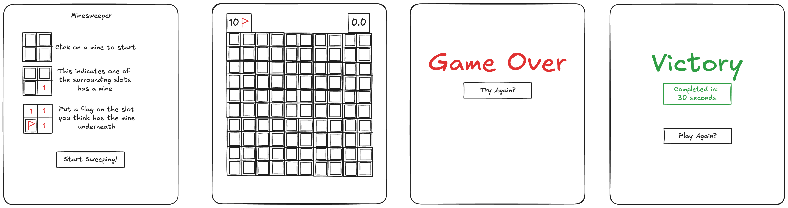

# Description

The aim for this project is to create a game. The game must be rendered in a browser using DOM manipulation techniques. The game must have clear UI so the player is able to understand how to play and know if they have won or lost. The game will be created with HTML, CSS and JavaScript and all the files myst be orginized properly. The game must include all the features which the original game has.


# Deployment link

https://justharry11.github.io/project-1/


# Getting Started/Code Installation

1. Clone the repository
2. Open the index.html with Live Server
3. Enjoy the game


# Timeframe & Working Team (Solo/Pair/Group)

I started working on this solo project on 31st March and finish on the 4th April


# Technologies Used

### Front End

  - HTML
  - JavaScript
  - CSS

### Other Tools

  - GitHub
  - Visual Studio Code


# Brief

### MVP

  - Render the game in the browser using the DOM manipulation techniques demonstrated in lecture.
  - Include win/loss logic and render win/loss messages in HTML. The game you chose must have a win/lose condition.
  - Include separate HTML, CSS, JavaScript, and JavaScript data files organized in an appropriate directory structure.
  - Include all required features specific to your game. Game-specific required features are defined in the Required Features column in the table in the Recommended Games document, or as discussed with your instructor. If you want to build a game that is not on this list, you will need to present and discuss your game’s features with the instructional team for approval.
  - The game is deployed online so that the rest of the world can play it.


# Planning




Here is how I wanted the game to look, I wanted to keep the layout simple and make it easy for the player to visually see the important aspects of the game.

### Psedocode

```
// * When the game starts up I want to see a welcome message and a button which begins the game.
//   Also a pannel on the left which gives the player instructions on how to play.

// * Once the player begins the game, a 10x10 grid will appear in the center of the screen
//   Above the grid is a timer to show how long the game has lasted
//   On the other side is the amount of flags you have remaining

// ? How will I generate the bombs onto the grid and the numbers displaying how many bombs are around each tile
//   The will start with a function which spawnsBombs
//      - It will spawn 10 random bombs across the grid
// !          I can image having some trouble with assigning the slot a class
//          - Generate 10 random numbers using math.floor and math.random
//          - Assinged the grid spot with the corresponding number a class of bomb but keep it hidden 
//      - Once spawned each individual grid slot will check how many bombs are around them
// !          This may cause me some trouble in figuring out how to check the 8 squares around the slot
//          - This is achived using the forEach function, checking each slot and whether the each a bomb on the surrounding grid and log the amount
//          - It will display the about of bombs

// * Once the game has begun the player can choose which grid slot to select
//   This will begin the timer
//   Once the slot is clicked it will either show
//      - An empty slot which will begin a flood fill and check all the connecting empty slots
//      - A number of the amout of bombs which are surounding it
//      - A bomb which will end the game
//          - A message will apear and the player will be able to play again
//          - A replay button will take the player to the start screen


// ? How will the player put flag on the slots they think have bombs inside
//   The player will right click the slot and a class will be added which displays a image of a flag to notify the player.

// * The player will keep on going until he has completed the board and what is left are the slots which have the bombs inside
//      - A message will appear congratulating them on winning the game
//      - The time taken will appear underneath
//      - They will click a button which allows them to play again
```


I created a trello board which allows me to set deadlines and layed out what I would be working on each day. Doing this helped as I neved felt rushed and as I was working alone I knew what needed to be done before I could start working on the next part. 

## User Story

### 1: Game Start

  - When the game loads I want the player to see the instrustions on how to play along with a clear buttons which tells the player to start the game.

### 2: Game

  - When the player begins the game a timer should appear to show how long they have been playing
  - The 10 x 10 board will apear in the center of the screen

### 3: First Selection

  - Once the player clicks on a given tile is should either
        - Show a blank tile and cascade and fill all connection empty tiles
        - Show the number of mines around the tile, clearing displayed in the center
        - Show a mine which will take them to the game over screen

### 4: Flag Possible Mines

  - The player should be able to right click on a slow which they think has a mine inside
  - This will be clearly displayed to the player

### 5: Win Condition

  - Once the player has cleared the board which only the 10 blank tiles with mines behind the player will be take to the win screen
        - The player will be greeted with a victory message
        - The time it has taken them to win
        - Play again button will be displayed to allow the player to play again

### 6: Lose Condition

  - If the player clicks on a tile with a mine behind they will be taken to the lose screen
        - The player will be shown the they have lost
        - A button to play again will apear


# Build/Code Process

## Mine Position

```
  function minePosition(){
    const minePositionArray = []
    
    while(true) {
        const randomPos = Math.floor(Math.random() * 99)

        if(!minePositionArray.includes(randomPos)){
            minePositionArray.push(randomPos)
        }
        if(minePositionArray.length === 10){
            break;
        }
    }
    
    minePositionArray.forEach((minePositionArray) => {
        const minePosition = document.getElementById(`${minePositionArray}`)
        minePosition.classList.add('mine')
    })
}
```
After building the grid, the next part was adding the mines to the grid. I was trying to figure how I wanted it to work and I ended up decided to add a class to the specific mine. The first error I came across was that it would add to the same slot if it generated the same number. I fixed this by making sure that it generated a unique number before pushing it to the array. 

## Mine Nearby Check

```
function minesNearbyCheck(){
    slots.forEach((slot) => {
        if(slot.classList.contains('mine')){
            return;       
        }
        let minesFound = 0;

        let leftPosition = slot.id -1;

        let rightPosition = slot.id - (-1);
        
        let upPosition = slot.id -10;

        let upRightPosition = slot.id -9;

        let upLeftPosition = slot.id -11;

        let downPosition = slot.id -(-10);

        let downLeftPosition = slot.id -(-9);

        let downRightPosition = slot.id -(-11);

        

        if(leftPosition >= 0 && leftPosition <= 99){
            if(slot.id % 10 !== 0){
                if(slots[leftPosition]?.classList.contains('mine')) {
                    minesFound ++;
                }
            }
        }
        if(rightPosition >= 0 && rightPosition <= 99){
            if(slot.id % 10 !== 9){
                if(slots[rightPosition]?.classList.contains('mine')) {
                    minesFound ++;
                }
            }
        }
        if(upPosition >= 0 && upPosition <= 99){
            if(slots[upPosition]?.classList.contains('mine')) {
                minesFound ++;
            }
        }

        if(upRightPosition >= 0 && upRightPosition <= 99){          
            if(slot.id % 10 !== 9){
                if(slots[upRightPosition]?.classList.contains('mine')) {
                    minesFound ++;
                }
            }
        }
        if(upLeftPosition >= 0 && upLeftPosition <= 99){
            if(slot.id % 10 !== 0){
                if(slots[upLeftPosition]?.classList.contains('mine')) {
                    minesFound ++;
                }
            }
        }
        if(downPosition >= 0 && downPosition <= 99){
            if(slots[downPosition]?.classList.contains('mine')) {
                minesFound ++;
            }
        }
        if(downLeftPosition >= 0 && downLeftPosition <= 99){
            if(slot.id % 10 !== 0){
                if(slots[downLeftPosition]?.classList.contains('mine')) {
                    minesFound ++;
                }
            }
        }
        if(downRightPosition >= 0 && downRightPosition <= 99){
            if(slot.id % 10 !== 9){
                if(slots[downRightPosition]?.classList.contains('mine')) {
                    minesFound ++;
                }
            }
        }
        
        slot.classList.add("level"+ `${minesFound}`) 
    })
} 
```
This and the recursive feature where two aspects of the game which I was most nervous about. The first step in understanded how to takle this was by drawing out the grid and I noticed that the slot above would have a id -10 which allowed me to work out the surround slots of a mine and add to the mines found variable. I made sure that it wouldnt calcualte when the slot it outside the board. Using the for each allowed me to check each slot and if there is a mine in the surround slots, once found it would add to their individual mines found variable which will be displayed later.

## Recursive Mine Sweep

```
function recursiveMineSweep(clickedSlotPosition){

    let leftPosition = clickedSlotPosition.id -1;
    let rightPosition = clickedSlotPosition.id - (-1);
    let upPosition = clickedSlotPosition.id -10;
    let downPosition = clickedSlotPosition.id -(-10);
    
    
    if(clickedSlotPosition.classList.contains('unclicked')){
        cleared ++;
        if(cleared === 90){
            winCondition()
        }
    }
    clickedSlotPosition.classList.remove('unclicked')
    
    if(clickedSlotPosition.classList.contains('level0')){

        if(leftPosition >= 0 && leftPosition <= 99){
            if(clickedSlotPosition.id % 10 !== 0){
                if(slots[leftPosition].classList.contains('level0') && slots[leftPosition].classList.contains('unclicked')){
                    recursiveMineSweep(slots[leftPosition])
                }
            }
        }
        if(rightPosition >= 0 && rightPosition <= 99){
            if(clickedSlotPosition.id % 10 !== 9){
                if(slots[rightPosition].classList.contains('level0') && slots[rightPosition].classList.contains('unclicked')){                   
                    recursiveMineSweep(slots[rightPosition])
                }
            } 
        } 
        if(upPosition >= 0 && upPosition <= 99){
            if(slots[upPosition].classList.contains('level0') && slots[upPosition].classList.contains('unclicked')){
                recursiveMineSweep(slots[upPosition])
            }
        }
        if(downPosition >= 0 && downPosition <= 99){
            if(slots[downPosition].classList.contains('level0') && slots[downPosition].classList.contains('unclicked')){
                recursiveMineSweep(slots[downPosition])
            }
        }
    }
    
}
```

```
function slotClicked(event){
    const clickedSlotPosition = event.target
    if(event.target.classList.contains('mine')){
        event.target.innerHTML = 'M'
        clearInterval(timerInterval)
        slots.forEach(slot => {
            slot.classList.remove('unclicked')
            slot.classList.remove('flag')
            if(slot.classList.contains('mine')){
                slot.innerHTML = 'M' 
            }  
        })
        gameTime.classList.add('hide')
        flagCounter.classList.add('hide')
        retryGame.classList.remove('hide')
        retryMessage.textContent = "Unlucky, You Lost!"
    }
    if(clickedSlotPosition.classList.contains("level1") && clickedSlotPosition.classList.contains("unclicked")){
        clickedSlotPosition.innerHTML = '1'
    }
    if(clickedSlotPosition.classList.contains("level2") && clickedSlotPosition.classList.contains("unclicked")){
        clickedSlotPosition.innerHTML = '2'
    }
    if(clickedSlotPosition.classList.contains("level3") && clickedSlotPosition.classList.contains("unclicked")){
        clickedSlotPosition.innerHTML = '3'
    }
    if(clickedSlotPosition.classList.contains("level4") && clickedSlotPosition.classList.contains("unclicked")){
        clickedSlotPosition.innerHTML = '4'
    }
    if(clickedSlotPosition.classList.contains("level5") && clickedSlotPosition.classList.contains("unclicked")){
        clickedSlotPosition.innerHTML = '5'
    }
    if(clickedSlotPosition.classList.contains("level6") && clickedSlotPosition.classList.contains("unclicked")){
        clickedSlotPosition.innerHTML = '6'
    }
    if(clickedSlotPosition.classList.contains("level7") && clickedSlotPosition.classList.contains("unclicked")){
        clickedSlotPosition.innerHTML = '7'
    }
    if(clickedSlotPosition.classList.contains("level8") && clickedSlotPosition.classList.contains("unclicked")){
        clickedSlotPosition.innerHTML = '8'
    }
    recursiveMineSweep(clickedSlotPosition)
}
```

Creating the recusive is similar to checking the positions of the nearby mines, but I figured out instead of checking all of the surrounding slots, all you needed to check was the top, bottom, left and right. Once the slot is clicked it would recurse through the slots until there are no more connecting level 0 (empty) slots. Creating and having this feature work was an amazing feeling and it was so satifitying when it worked for the fisrt time. 


# Challenges

### Recursive

This was my first time dealing with recursive and it was by far the biggest challenge of making this game. The problem was understanding how I would be able to incorperate this feature in and being able to fully understand how it works. I knew that this would be a difficult part of the game so I made sure to spend a whole morning researching how it works and I gave myself a day to incorperate it in. I feel confident with the system now but I feel like that is all down to the time I spent researching and testing how it would work in my game.


# Wins

I problem I found was through testing I realised that if I dragged my mouse over the screen it would show where the mines where, I was trying to figure out a way so that the 'M' would only appear when the button is pressed. Even though it was a small issue I was happy that I was able to figure out where the problem was and how to fix it. This was a common feeling throughout this project where it was about understanding where the issue was and trying to find a way of fixing it which was very enjoyable.


# Key Learnings/Takeaways

This project allowed me to get a better base understanding of JavaScript and see what you could do with it.

 - Using what we learnt in the first couple weeks and how important and useful those features where.
 - How to use event listeners to manage the DOM.
 - How writing out what I want the game to do allowed me to understand the process and what needed to be done first and how everything would work with eachother.
 - Working to a brief on my own and having that structure where I knew what I need to do and when, this was also helped by pseudocode and user stories so I knew how the player would react and what they had to deal with.


# Future Improvements

### Features to add

 - Options for different size boards.
 - The mines are generated after the first press so the player cant get unlucky and lose straight away.


